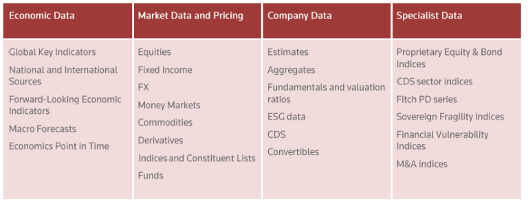
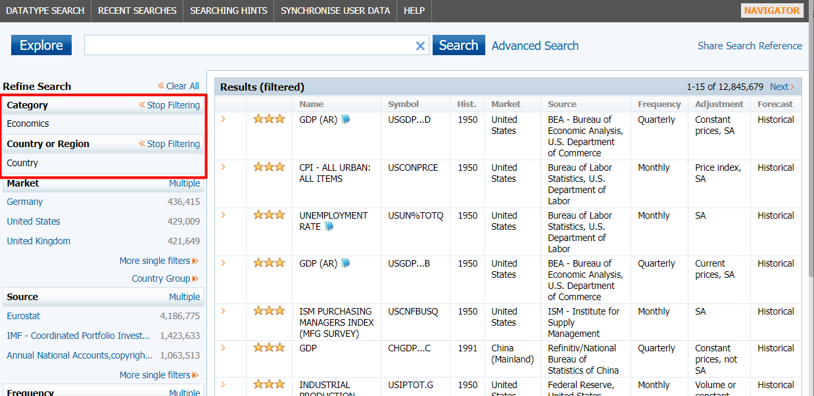
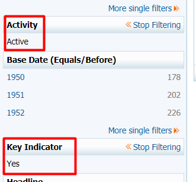
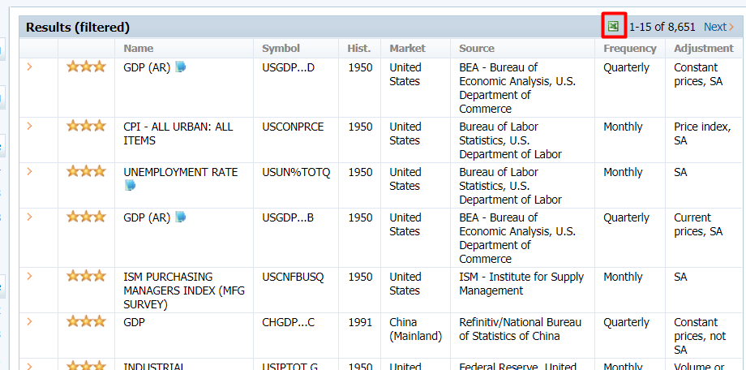
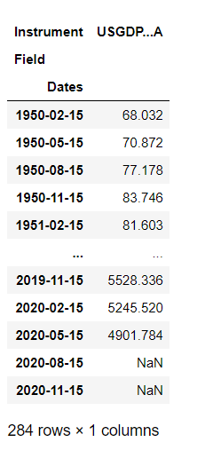
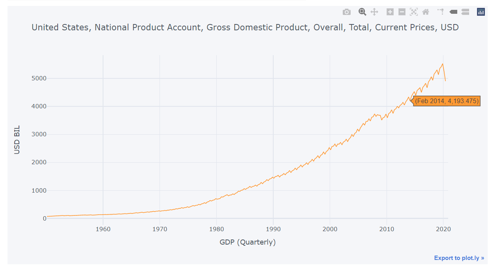

# Economic Indicators with Datastream

An economic indicator is a statistic matric of an economic activity used by investors to evaluate the overall health of an economy and predict  future investment possibilities. Economic indicators are typically surveyed or gathered by a government department or private organization. Economic indicators cover many things including the unemployment rate, inflation rate, gross domestic product, population, bankruptcies, etc.

This article demonstrates how to use Datastream to access cross-countries' economic indicators.  

## Datastream

Datastream is the world’s leading time-series database, enabling strategists, economists, and research communities’ access to the most comprehensive financial information available. With histories back to the 1950s, you can explore relationships between data series; perform correlation analysis, test investment and trading ideas, and research countries, regions, and industries.

The Datastream database has over 35 million individual instruments or indicators across major asset classes. You can directly invoke the web service methods from your own applications by using metadata information we publish.

The Datastream Web Service allows direct access to historical financial time series content listed below.



For more information, please refer to [Datastream Web Service](https://developers.refinitiv.com/en/api-catalog/eikon/datastream-web-service).


## Example

In this section, I will walk through a DataStream Web Service example used to retrieve economic indicators by countries. The example uses the [DatastreamDSWS](https://pypi.org/project/DatastreamDSWS/) library to connect and retrieve data from Datastream. To use this Python library, please refer to the [Getting Started with Python](https://developers.refinitiv.com/en/api-catalog/eikon/datastream-web-service/Documents) document.

### Loading Libraries
The required packages for this example are:

- **DataStreamDSWS**: Python API package for Refinitiv Datastream Webservice
- **pandas**: Powerful data structures for data analysis, time series, and statistics
- **ipywidgets**: IPython HTML widgets for Jupyter
- **IPython.display**: Public API for display tools in IPython
- **Cufflinks**: Connecting Plotly with pandas to create graphs and charts of data frames directly

You also need to install lxml package (pip install lxml) used by pandas when parsing the HTML file.

In this article, we will use cufflinks offline mode which is quite enough for Jupyter Notebook usage.


```python
import DatastreamDSWS as DSWS
import pandas as pd
import ipywidgets as widgets #IPython widgets 
from ipywidgets import Button, HBox, VBox, Layout, Dropdown, Label
from IPython.display import display, clear_output
import cufflinks as cf

cf.set_config_file(offline=True) 
```

## Setting Credentials

The DataStream username and password are required to run the example. 


```python
ds = DSWS.Datastream(username = 'username', password = 'password')
```

### Loading an Instrument List

In [Datastream](http://product.datastream.com/browse/), the economic indicators are available under the **Economics** category. The data can be filtered by countries.



A table on the right displays all economic data available in Datastream. 

In this example, we only focus on active key indicators so we add two filters (**Activity** and **Key Indicator**) to refine the search result.



From the search results, there are around 8,600 active key indicators. 



After that, the search results can be downloaded to an excel file (**ActiveKeyIndicators.xls**). This excel file can be read into a data frame object by calling the **pandas.read_html** method. In the data frame:
- The **Name** column contains short indicator names
- The **Symbol** column contains instrument names used by Datastream to retrieve data
- The **Market** column contains country names
- The **Full Name** column contains full indicator names
- The **Frequency** column contains the frequency of the time-series data


```python
df = pd.read_html('ActiveKeyIndicators.xls')  
df[0][["Name","Symbol","Market","Full Name","Frequency"]]
```

### Economic Indicators By Countries

In this section, we will create a widget that allows users to display available economic indicators by selecting a country. First, it sets the **display.max_rows** option to 200 to increase the maximum number of rows and columns displayed by the data frame.

The widget displays a list of countries including the number of indicators in the dropdown list. After selecting a country, the economic indicators in that country are displayed.


```python
pd.set_option('display.max_rows', 200)
class ListAllECIByCountryWidget:    
    status_label = Label("")
    title_label  = Label(value='')
    linebreak_label = Label('')   
    button = Button(description='Select')
    output = widgets.Output()
    
    def __init__(self, _context):
        
        country_count = _context.groupby(["Market"])["Symbol"].count()
        self.country_dropdown = Dropdown(options=[(index+" ("+str(value)+")", index) for index, value in country_count.items()], value='United States', description='Country:')
       
        display(HBox([self.country_dropdown,self.button]),            
                self.output)
        
        self.button.on_click(self.on_button_clicked)  
        self._context = _context
        
        
    def on_button_clicked(self,c):
        with self.output:
            self.output.clear_output() #clear and update output
            self.title_label.value = r'\(\underline{\textbf{%s}}\)'%(self.country_dropdown.value)
            display(VBox([ HBox([self.linebreak_label]),
                          HBox([self.title_label])
                         ]))
           
            display(self._context[self._context["Market"]==self.country_dropdown.value].set_index('Symbol')[["Name","Start Date","End Date","Frequency","Source","Full Name"]])
                        
                    
ListAllECIByCountryWidget(df[0])
```

### Historical Economic Indicators By Countries

In this section, we will create a widget that displays historical data of a selected economic indicator. First, users need to select a country. Then, the widget creates a dropdown list containing economic indicators available in the selected country.

After selecting the economic indicator, the widget calls the **get_data** method in the **DataStreamDSWS** library to retrieve the unit of the historical data.

```
ds.get_data(tickers=symbol, fields=["ESUNT"],kind=0)

```
The **symbol** represents the Datastream symbol of the selected economic indicator. The **ESUNT** data type gives the unit quotation of the series. For example, the unit quotation of the **United States Gross Domestic Product (USGDP...A)** is **USD BIL**.

Next, the widget calls the **get_data** method again to retrieve the historical data.

```
ds.get_data(tickers=symbol, start='BDATE',freq=freq)
```

The **BDATE** is the base date representing the date from which Datastream holds information about the issue. The **freq** parameter is the frequency of historical data. It could be **D** (Daily), **W** (Weekly), **M** (Monthly), **Q** (Quarterly), and **Y** (Annual). The widget gets the frequency of the selected economic indicator from the **Frequency** column in the data frame. For example, the quarterly historical data of **United States Gross Domestic Product (USGDP...A)** since BDATE (1 Jan 1950) is shown below.



Finally, the widget calls the **iplot** method to plot a chart.




```python
class HistoricalECIWidget:    
    status_label = Label("")
   
    eci_dropdown = Dropdown()
    eci_dropdown.description = "Economic:"
    status_label = Label("")
    title_label  = Label(value='')
    linebreak_label = Label('')        
    button = Button(description='Select')
    output = widgets.Output()
    
    def __init__(self, _context):
        country_count = _context.groupby(["Market"])["Symbol"].count()
        self.country_dropdown = Dropdown(options=[(index+" ("+str(value)+")", index) for index, value in country_count.items()], value='United States', description='Country:')
        
        display(HBox([self.country_dropdown]),
                HBox([self.eci_dropdown,self.button]),
                self.title_label,
                self.status_label,
                self.output)
        
        self.button.on_click(self.on_button_clicked)  
        self._context = _context.set_index("Symbol")
        tuple_list = self._context[self._context["Market"]==self.country_dropdown.value].sort_values(by=['Name'])[["Full Name"]].to_records(index=True).tolist()
        self.eci_dropdown.options = [t[::-1] for t in tuple_list]
        self.country_dropdown.observe(self.on_country_change)

    def _get_frequency(self, freq):
        switcher={
                'Daily':'D',
                'Weekly':'W',
                'Monthly':'M',
                'Quarterly': 'Q',
                'Annual': 'Y'
        }
        if freq in switcher:
            return switcher[freq]
        else:
            return None
               

    def on_button_clicked(self,c):   
        with self.output:
            self.output.clear_output()            
            symbol = self.eci_dropdown.value
            title = self._context.loc[symbol,"Full Name"]
            self.title_label.value = r'\(\underline{\textbf{%s}}\)'%(title)
            temp_unit = ds.get_data(tickers=symbol, fields=["ESUNT"],kind=0)
            unit = temp_unit.iloc[0,2]
            freq = self._get_frequency(self._context.loc[symbol,"Frequency"])
           
                                    
            if freq==None:
                self.status_label.value = "Unable to match a frequence: " + self._context.loc[symbol,"Frequency"]
                return
                                                                                              
            display(self._context.loc[[symbol],["Name","Start Date","End Date","Frequency","Source"]])
            
            display(ds.get_data(tickers=symbol, start='BDATE',freq=freq).iplot(title=title,yTitle=unit, xTitle=self._context.loc[symbol,"Name"]+" ("+self._context.loc[symbol,"Frequency"]+")"))
        
    def on_country_change(self, change):       
        with self.output:            
            self.eci_dropdown.options = []
            tuple_list = self._context[self._context["Market"]==self.country_dropdown.value].sort_values(by=['Full Name'])[["Full Name"]].to_records(index=True).tolist()
            self.eci_dropdown.options = [t[::-1] for t in tuple_list]            
            
                    
HistoricalECIWidget(df[0])
```

## Summary
This article demonstrates how to use the Datastream Web Service to retrieve historical economic indicators for each country. First, it gets a list of key economic indicators from the [Datastream website](http://product.datastream.com/browse/) and loads the list to the data frame. Then, it creates two widgets. The first widget allows a user to choose a country and then it displays a list of economic indicators available in that country. The second widget allows a user to pick an economic indicator, then it displays a historical chart of the selected economic indicator.


## References
1. Developers.refinitiv.com. n.d. Datastream Web Service | Refinitiv Developers. [online] Available at: <https://developers.refinitiv.com/en/api-catalog/eikon/datastream-web-service> [Accessed 30 October 2020].
2. En.wikipedia.org. n.d. Economic Indicator. [online] Available at: <https://en.wikipedia.org/wiki/Economic_indicator> [Accessed 30 October 2020].
3. Corporate Finance Institute. n.d. Economic Indicators - Learn More About GDP, PMI, and CPI. [online] Available at: <https://corporatefinanceinstitute.com/resources/knowledge/economics/economic-indicators/> [Accessed 30 October 2020].


```python

```
